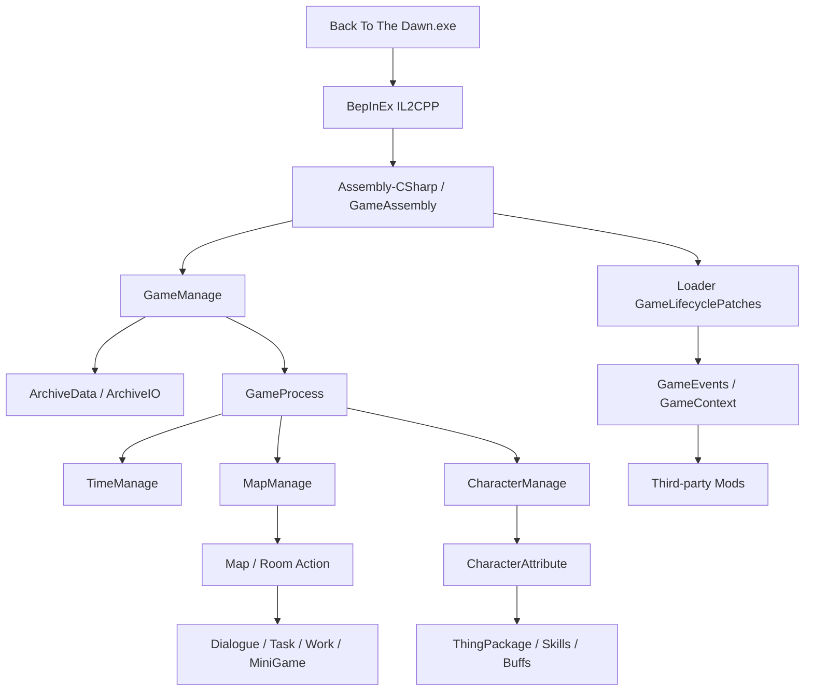

# Back To The Dawn 游戏系统分析

> 分析快照：Windows x64，Unity `2020.3.2f1c1`，IL2CPP Metadata `27.1`，Steam App ID `1735700`，Build ID `23125213`。
>
> 本文面向 Mod 作者和加载器维护者。它描述的是当前游戏二进制和 IL2CPP 互操作程序集里可以确认的系统，不是剧情攻略，也不是把所有类名直接等同于完整玩法。

## 1. 证据等级和阅读方式

本次结论来自四类材料：

| 证据 | 位置 | 可信度 | 用途 |
|---|---|---:|---|
| 游戏本体 | `Back To The Dawn.exe`、`GameAssembly.dll`、`Back To The Dawn_Data/` | 高 | 确认运行时、场景和资源规模 |
| BepInEx IL2CPP 互操作程序集 | `BepInEx/interop/Assembly-CSharp.dll` | 高 | 确认游戏类、方法、字段和可 Hook 签名 |
| 第一方配置模型 | `BepInEx/interop/Assembly-CSharp-firstpass.dll` | 高 | 确认物品、技能、NPC、商店等数据字段和枚举 |
| AssetRipper 重建脚本 | `docs/GAME_UNPACKING.md` 记录的导出目录 | 中 | 了解对象关系、Prefab/场景命名和组件分布 |

需要特别注意：IL2CPP 互操作程序集可以可靠地告诉我们“有什么类型和入口”，但不一定保留方法体；AssetRipper 对脚本组件通常只生成签名占位。因此：

- “已确认”表示类型、成员或运行时调用已经直接观察到。
- “代码推断”表示由命名、字段和调用关系推测，尚未做行为实验。
- “待验证”表示需要启动游戏、安装临时 Postfix 或读取实际配置后才能确定。

不要仅凭 `ItemID.Painkiller`、`TaskTargetType.GiveMedicine` 之类的名字断言数值、剧情条件或实际效果；名称是线索，行为要以运行时验证为准。

## 2. 游戏总体结构

这是一个 Unity IL2CPP 游戏。当前导出的 Build Settings 中主要启用一个 `Game` 场景（Build Index 0），主菜单、读档、正式游戏和各种房间并不是通过大量 Unity 场景切换实现，而是由同一场景里的管理器、地图对象和 UI 状态控制。



### 2.1 文件和运行时层

游戏目录的关键文件：

- `Back To The Dawn.exe`：Unity 启动程序。
- `GameAssembly.dll`：IL2CPP 转换后的游戏逻辑。
- `Back To The Dawn_Data/globalgamemanagers`、`resources.assets`、`level0`：Unity 全局对象、资源和主场景数据。
- `BepInEx/interop/Assembly-CSharp.dll`：由 BepInEx 生成的 C# 互操作签名，适合 Harmony 反射和编译期引用。
- `BepInEx/interop/Assembly-CSharp-firstpass.dll`：第一方/共享数据类和枚举，包含大量 `c_*` 配置模型。
- `BepInEx/LogOutput.log`：加载器、Mod 和运行时诊断日志。

游戏运行时不是普通 Mono 程序。Mod 可以使用 Harmony 对互操作类型打补丁，但不能把 C# 反编译出来的空方法体当作原始源码，也不应直接修改 `GameAssembly.dll`。

### 2.2 管理器大致分层

| 层 | 代表类型 | 主要职责 |
|---|---|---|
| 启动/流程 | `GameManage`、`GameProcess` | 启动步骤、主菜单、读档、显示地图、玩家控制 |
| 存档 | `ArchiveData`、`ArchiveIO`、`ArchiveManage` | 运行数据、自动/手动/冠军存档、读取和保存 |
| 世界 | `MapManage`、`Map` | 地图加载、当前地图、传送、镜头、房间交互 |
| 时间 | `TimeManage`、`GameProcess.PassMinutes` | 分钟推进、日历和时间回调 |
| 角色 | `CharacterManage`、`Character`、`CharacterAttribute` | 主角、囚犯、狱警、NPC 属性和状态 |
| 物品 | `ItemManage`、`ThingPackage`、`Thing` | 物品配置、背包实例、装备、移动和消耗 |
| 玩法 | `BattleManage`、`TaskManage`、`WorkManage`、`ShopManage` | 战斗、任务、工作、商店和生产 |
| 社交 | `TalkManage`、`RelationshipManage`、`GangManage` | 对话、关系、帮派、声望和帮派贡献 |
| 表现 | `UI_*`、`Widget*`、`Action*` | UI、按钮、场景交互和流程动作 |

## 3. 启动、读档和主循环

### 3.1 已确认的启动链

`GameManage` 暴露了以下关键入口：

| 方法 | 作用 | 当前判断 |
|---|---|---|
| `InitGame()` | 建立游戏管理器和初始状态 | 已确认存在 |
| `InitGameStartOrderList()` | 初始化启动步骤列表 | 已确认存在 |
| `StartGameGoToNextStep()` | 推进启动步骤 | 已由加载器用于 `StartupStepChanged` |
| `ShowGameStartUI(bool, int)` | 显示主菜单或启动 UI | 已由加载器用于 `MainMenuEntered` |
| `ReadArchiveDataAndStartGame(int)` | 读取指定存档并启动游戏 | 已由加载器用于存档事件 |
| `FirstLoadAllMap(int)` | 首次加载地图 | 已确认存在 |
| `FirstArrangeAll(float)` | 首次整理/布置运行对象 | 已确认存在 |
| `FirstLoadUIMenu(float)` | 首次加载菜单 UI | 已确认存在 |
| `ShowCurrentMapAndCanControl()` | 显示当前地图并恢复玩家控制 | 当前 `GameplayReady` 的最佳信号 |
| `EndGameToReStart(int)` | 结束后重新开始 | 已确认存在 |
| `ExitGame()` | 退出游戏流程 | 已确认存在 |

当前推荐的生命周期顺序：

```text
Unity/BepInEx 初始化
  -> GameManage.InitGame
  -> StartGameGoToNextStep（启动步骤）
  -> ShowGameStartUI（主菜单）
  -> ReadArchiveDataAndStartGame（用户选档）
  -> ArchiveData / ArchiveIO 读取
  -> 首次加载地图、角色、UI
  -> ShowCurrentMapAndCanControl
  -> GameplayReady
```

### 3.2 对 Mod 的含义

- 只需要在主菜单显示文本、注册键盘输入或准备配置：订阅 `MainMenuEnteredEvent`。
- 需要知道存档开始读取：订阅 `ArchiveLoadStartedEvent`。
- 需要读玩家、地图、时间或背包：等待 `GameplayReadyEvent`，不要在 `ArchiveLoadInvocationReturnedEvent` 里立即访问。
- 需要在关闭时释放资源：实现 `IMod.Shutdown()`，释放 `GameEvents.Subscribe<T>()` 返回的 `IDisposable`。

## 4. 时间、天数、工作和日常循环

### 4.1 时间

`GameProcess` 具有 `InitTime()`、`PassMinutes(int, bool)`、`PassMinutes(TimePass)`、`IsInGaming()` 和 `GetLastGameTime()` 等成员。实际时间推进可能由多个系统共同触发，不应只盯着 UI 文本。

加载器目前在两个 `PassMinutes` 重载上使用 Postfix，并通过快照去重后发布 `TimeChangedEvent`。快照包含：

- 天数/日期相关值；
- 醒来日或当前日序号；
- 小时、分钟和累计分钟数。

时间推进通常是很多玩法的共同驱动源：工作结束、睡觉、NPC 行动、物品过期、商店刷新、任务时间条件和状态效果都可能挂在这里。为了减少版本耦合，Mod 应监听 `TimeChangedEvent`，不建议直接改写 `PassMinutes` 参数。

### 4.2 工作和作息

`WorkManage`、`WorkInfo`、`WorkActionID`、`WorkType` 组成工作/日程系统。`WorkType` 中已经出现以下时段或活动：

```text
Morning, Noon, Afternoon, Evening, Sleep,
StayCell, Confinement, Hospital, Lunch, Bath, TV, Gamble,
PrisonBreak, Plan, Corridor, CorridorDoorOut,
MorningUsePhone, EveningUsePhone,
InBoxingMatch, AfterBoxingMatch,
AfterNoonBeDriveAway, MorningBeDriveAway
```

`WorkActionID` 中可以确认的生产/劳动动作包括：

```text
AssistCooking, BlendDetergent, BrushAsphalt, CarryFlour,
CarryPotatoes, CarryVegetables, DealLetter, IronClothes,
MowLawn, PeelPotatoes, Pickle, SortParcel,
TransportAsphalt, WashDishes
```

这些名字说明游戏有“时段安排 + 具体工作动作”两层模型，但每个动作的奖励、失败条件和动画仍应运行时验证。合适的后续公共事件是 `WorkStarted`、`WorkCompleted` 和 `WorkCancelled`，而不是把每个 UI 按钮都暴露给 Mod。

## 5. 地图、房间和场景交互

### 5.1 MapManage / Map

`MapManage` 负责地图集合和当前地图状态，已确认的能力包括：

- `GetMap`、`GetMapName`、地图查找；
- `LoadMap`、`LoadWholeMap`；
- `GoToMap` 的多个重载；
- `SetCurrentMapAndShow`、`SetBattleMap`；
- `IsConnectedMap`；
- 判断主角是否在牢房、战斗休息室或监狱建筑中。

`Map` 负责单张地图对象，包含 `InitMap`、`FocusMap`、`InitBlockInteractionList`、`GetInteractionList`、`GetInteraction`、`GetSceneAreaPosition`、`ShowMapEvent` 等成员，并能报告某些环境状态，例如警卫监视、有害气体和摄像/监控状态。

加载器当前用 `Map.FocusMap` 的 Postfix 识别当前地图变化，并发布 `MapChangedEvent`。这比监听每一个传送按钮更稳定。

### 5.2 MapID 位置目录

互操作程序集中的 `MapID` 有约 100 个命名位置。以下按功能分组，名称是代码标识符的转写，不等于 UI 中文名：

**监狱核心和牢房**

```text
Hall1, Hall2, CellSigle, CellDouble, Confinement,
CorridorA1, CorridorA2, CorridorB1, CorridorB2,
GuardLounge, Guard1L, Guard2L, PrisonGuardRoom,
WardenOffice, InterrogationRoom, VisitingRoom
```

**生活和公共区域**

```text
Canteen, CanteenRiot, BathRoom, LandryRoom, HospitalLaundryRoom,
Playground, RelaxationArea, Cafe, CafeOutside,
CommercialStreet, BarberShop, VideoStore, Church, ChurchHall,
ClubBox, ClubCorridor, ClubHall, ClubLounge, ClubToilet,
Casino, BoxingRoom, FightLounge, FightArena, FightVipLounge,
TVHallWay, TVStation, TVStationStudio
```

**医疗、心理和管理**

```text
Hospital, MedicalWard, MedicalLaboratory, MedicalLaboratoryRiot,
Mental_Clinic, Mental_Corridor, MentalCleaningRoom, MentalWardCorridor,
OperatingRoom, Ward,
ComprehensiveBuilding, ElectionAndLiveRoom, NewsReport
```

**后勤、生产和地下区域**

```text
Kitchen, KitchenCook, KitchenCellar, BoilerRoom,
ProductionTeamBob, ProductionTeamFox, RoofToolRoom, RoofWorkSite,
MailRoom, WastePipe, SewageRoom, EndOfTheSewer,
Drainage, PipelineArea, PipelineAreaB, Reservoir,
SignalTower, SearchlightArea, SafePlace
```

**监狱外和剧情区域**

```text
BackAlley, Border, SuburbsHighway, ParkingLot,
BobBridge, BobIsland, BobParking, BobPhotoStudio,
BobRentalHouse, BobGangsterTrading, BobLous, BobNewsComic,
FoxHomeEnd, ApartmentVilla, ApartmentBlock, ApartmentFenrir,
Cemetery, Dream1, Dream2, FortressDungeon
```

还有 `DiveMiniGame`、`ClubHall_CardGame`、`BoilerRoomPipeGame` 等专用小游戏/事件地图。完整枚举应以当前互操作 DLL 为准，更新游戏后重新生成清单。

### 5.3 ActionMapping 和房间事件

许多房间交互类以 `ActionMapping<Room>` 或 `Action*` 命名，例如 Cell、Canteen、Corridor、Church、ClubHall、Kitchen、Hospital、Mental、Sewer、TVStation 等。它们通常负责：

1. 判断玩家是否满足位置、时间、物品和状态条件；
2. 打开对话、小游戏或操作菜单；
3. 通过 `ProcessState`/动作链推进多个步骤；
4. 在结尾改变角色、任务、时间或物品。

大量 `*Event` 类型是房间/剧情事件管理器，不一定是 .NET 事件。对 Mod 来说，优先 Hook 事件的高层完成入口或新增公共事件，不要把所有 `Action*` 类都直接暴露出去。

## 6. 角色、囚犯和 NPC

### 6.1 CharacterManage

`CharacterManage` 负责角色生命周期和查找：

- `CreateCharacter`、`LoadCharacter`、`RemoveCharacter`；
- `GetCharacter`、`GetCharacterAttribute`；
- `InitCharacterList`、`ReadAttributeInfo`；
- 主角、室友、牢房和战斗角色查找；
- `IsProtagonist` 和 `SetBattleCharacter`。

不要把角色编号直接当成“永远固定的 NPC 名称”。当前运行时事件会过滤主角，但存档、剧情和不同版本可能影响 ID。

### 6.2 CharacterAttribute 数据面

`CharacterAttribute` 是角色的核心状态对象。已经确认的字段/属性类别如下：

| 类别 | 代表成员 |
|---|---|
| 身份 | `id`、`type`、`GetName`、`GetFullName`、`GetAnimalName`、`GetArtName`、`GetJobName` |
| 生存 | `health/healthMax`、`mentality/mentalityMax`、`satiety/satietyMax`、`energy/energyMax`、`focus/focusMax` |
| 基础属性 | `strong`、`dexterity`、`intelligence`、`endurance`、`charm`、`physical`、`discipline` |
| 资源和成长 | `money`、`friend`、`prestige`、`fameId`、`digestion/digestionMax`、`life` |
| 监狱身份 | `gangId`、`gangStatus`、`prisonTerm`、`alreadyPrisonTerm` |
| 社交 | `affection`、`friendLowerLimit`、`friendUpperLimit`、`CharacterOpinion`、`CharacterGang` |
| 归属 | `CharacterCell`、`CharacterWork`、当前工作和牢房信息 |
| 状态 | `CharacterBuffManage`、`CharacterEffectMange`、`stateObjectList`、`markObjectList` |
| 技能 | `CharacterSkill` 列表、技能经验和天赋数据 |
| 物品历史 | `itemUseHistoryList`、`permanentItemUseHistoryList` |

已确认的行为入口包括 `LearnSkill`、`GetAbleSkillList`、`GetAbleTalentSkillList`、`AddSkillTypeExp`、`AddSkillTypePoint`、`AddMarkObject`、`AddStateObjectValue`、`ReceiveWork`、`EndCurrentWorkEarly`、`MoveToSleep`、`UseItem`、`EquipmentItem`、`RemoveEquipmentItem`。

当前公共 `PlayerStateChangedEvent` 只报告主角生命、心态、饱食、精力、专注和金钱的实际变化，并提供不可变快照。未来如果要支持属性、Buff、技能变化，应新增语义事件，不建议直接让 Mod 修改 `CharacterAttribute`。

### 6.3 第一方 NPC/囚犯配置

`Assembly-CSharp-firstpass.dll` 中的 `c_NPC` 和 `c_prisoner` 是配置/静态数据模型：

`c_NPC` 包含 NPC ID、类型、姓名、职业、工作地点、生命、基础属性、警卫标记、初始装备/物品/技能、故事 ID 和顺序等字段。

`c_prisoner` 包含囚犯 ID、角色类型、动物类型、牢房、帮派/身份、初始金钱/物品/技能、睡眠/工作/室友、故事/介绍以及体能/战斗属性。

这些类非常适合做“内容浏览器”或生成 Mod 数据报告；若要在游戏中改写已经生成的角色，必须确认读取时机和存档覆盖风险。

## 7. 物品、背包和装备

这是当前 Hook 工作最完整的系统，也是最适合继续扩展公共事件的部分。

### 7.1 三层物品模型

```text
c_item（静态配置：这个物品是什么）
       ↓ ItemManage
Thing（运行时实例：这个物品当前有多少、放在哪里、耐久如何）
       ↓ ThingPackage
角色/牢房/商店/地图容器（这个实例属于谁、位于何处）
```

### 7.2 Thing

`Thing` 的已确认成员包括：

- `id`、`count`、`place`（`PlaceInfo`）；
- `useCount`、`degree`、耐久、电池等运行时值；
- 物品配置引用；
- `IsCanUse`、`IsEquipment`、`IsWeapon`；
- `GetThingName`、`GetInteractiveDesc`、`GetRemainUseCount`；
- 电池、耐久和消耗相关方法。

`Thing` 是实例，不应作为跨存档或跨版本的稳定 ID；稳定识别通常应记录 `ItemId`，必要时再记录数量、来源和时间。

### 7.3 ThingPackage

`ThingPackage` 同时承担背包、装备和多个容器的操作：

**增删和移动**

```text
AddItem, AddItemOneByOne, AddThing,
RemoveThing, ReduceThingCount, ReduceItem,
MoveThingPlace(Thing, PlaceType),
MoveThingToBedRoom, MoveThingToCell,
ArrangeThingList
```

**查询**

```text
GetItemList, GetItemListByItemId, GetThingCount,
GetEquipmentList, GetEquipedWeapon, GetEquipedSecondaryWeapon,
GetBodyContrabandValue, GetNextEmptyPlace
```

**角色状态变化**

```text
ChangeEnergy, ChangeMoney, ChangeHealthy,
ChangeMentality, ChangeSatiety, ChangeFocus,
ChangeFriend, ChangeGangFriend, ChangeGangContribution,
ChangeDiscipline, ChangeFame, ChangeCaseMaterial,
AddAttirbute, ChangeAttirbute, SetAttirbute
```

**使用**

```text
UseThing, UseBatchThing
```

### 7.4 PlaceType 容器

第一方枚举中可以确认的容器包括：

```text
Equipment, Pocket, Cabinet, Bed,
CellFixedCabinet, BathroomWardrobe, Desk, UnderBed,
TaskPocket, KeyPocket, LetterPocket, HideGrid,
FightLoungeBed, FightLoungeDesk, FightLoungeShower,
CasinoSink, Hall1Letterbox, PipelineAreaFan, Wall
```

`Equipment -> Pocket` 的移动是本次已验证的“卸下”语义来源：`ThingPackage.MoveThingPlace` 的 Prefix 保存旧位置，Postfix 在成功移动后发布 `Unequip`。这比只监听按钮更接近实际状态变化。

### 7.5 c_item 静态配置

`c_item` 字段说明游戏的物品系统不只是“名称 + 效果”，还包含：

| 组 | 代表字段 |
|---|---|
| 分类 | `item_id`、`item_type`、`item_type_2`、`interactive_type` |
| 经济 | `item_value`、`buy_item_price`、`contraband`、`tradable`、`treasure` |
| 堆叠/使用 | `max_stack`、`max_use`、`batch_use` |
| 耐久/电池 | `max_durability`、`fight_durability`、`dice_durability`、`max_battery`、`battery_p` |
| 生产 | `produce_material`、`produce_number`、`produce_order`、`produce_time`、`produce_type`、`produce_energy`、`produce_leader` |
| 解锁 | `produce_unlock_1`、相关解锁字符串 |
| 参数 | `item_p_A`、`item_p_B`、削弱/变体参数 |
| 限制 | 副作用、使用次数、使用限制、可食用/可喂食标记 |
| 文本 | 名称、描述、类型的本地化 key |

`c_itemExtension` 提供了更适合工具和 Mod 使用的分类器：

```text
IsAlcohol, IsBillItem, IsCanBeDestory, IsCanBeGift,
IsCanStack, IsContraband, IsEquipment, IsFood,
IsHaveBattery, IsHaveDurability, IsHaveSideEffect,
IsHaveUseLimit, IsHaveUseTimes, IsItemFuncAOpen,
IsItemFuncBOpen, IsKeyItem, IsMedicine,
IsPackageConsumeItem, IsTaskItem, IsTreasure
```

还可以读取 `GetName`、`GetDesc`、`GetTypeDesc`、`GetBuyPrice`、`GetBuyRealPrice`、`GetContraband`、`GetEquipmentPlaceId`、`GetCostDurability`、`GetItemPARealTime`、`GetItemPBRealTime`、`GetOnceProduceNumber`、`GetProduceMaterial` 和电池信息。

### 7.6 ItemID 规模和例子

当前 `ItemID` 有约 284 个静态整数属性。已见到的类别/例子包括：

- 食品和饮品：`Apple`、`Cheese`、`Pizza`、`Beer`、`CoffeeBean`、`CoffeePowder`、`IcedCoffee`；
- 药品：`Painkiller`、`SleepingPill`；
- 文具/任务：`Pencil`、`Paper`、钥匙、密码、许可证；
- 电池和工具：电池、手电筒相关物品；
- 装备：`Belt`、`MotorcycleGloves`、`PoliceGloves`、`RubberShoes`、`GuardGasMask`、`PunkSunglasses`、`Pendant`、`Mask`；
- 武器/工具：`Baton`、`Scalpel`、`Crowbar`、滑翔伞相关物品；
- 属性类标识：`Health`、`Mentality`、`Energy`、`Satiety`、`Focus`、`Strong`、`Dexterity`、`Intelligence`、`Charm`、`Money`、`Prestige`、`Friend`、`GangFriend`、`GangContribution`、`CaseMaterial`。

这些名字可用于生成物品目录，但具体数值、是否可堆叠、使用后的效果和解锁条件仍应读取 `c_item` 或在运行时验证。

公共 Mod API 会把这些名称规范化为 `backtothedawn:<path>` 命名空间键，例如
`backtothedawn:apple`。物品定义和物品事件默认不暴露数字 ID；只有需要调用游戏底层整数参数时，
才通过独立的 `ItemIdResolver` 转换。静态键目录在 Loader 启动时可用，运行时 `c_item` 补全后触发
`ItemCatalogReadyEvent`。

### 7.7 当前物品事件和剩余缺口

加载器已经把玩家物品操作统一为 `PlayerItemActionEvent`：

```text
Use, Arrange, Destroy, Equip, Unequip, Move, OperationSelected
```

已验证的底层入口：

| 语义 | 入口 | 方式 |
|---|---|---|
| 使用 | `CharacterAttribute.UseItem(int,int,ThingChangeReason)` | Postfix |
| 整理 | `WidgetItemMiddleTools.ArrangePocketItemList()` | Postfix |
| 摧毁 | `WidgetItemOperationButton.SubmitConfirmDestoryItem` | Postfix |
| 装备 | `CharacterAttribute.EquipmentItem(Thing)` | Postfix |
| 卸下 | `ThingPackage.MoveThingPlace(Thing,PlaceType)` | Prefix + Postfix |
| 菜单选择 | `WidgetItemOperationButton.ClickA()` | 兜底记录原始操作类型 |

仍值得继续补充的语义事件：赠送、交易、购买、出售、生产消耗、物品移动到房间容器、战斗内使用、物品效果实际结算。通用监视器可以先记录 `CharacterAttribute.UseItem`、`ThingPackage` 的增删/移动和所有 `Change*` 方法，再按实际日志归纳新事件，而不是为每个物品 ID 写一份 Hook。

## 8. 属性、效果、Buff 和技能

### 8.1 角色状态子系统

角色状态相关类型包括：

- `CharacterBuffManage`：可叠加、可显示或有持续时间的 Buff；
- `CharacterEffectMange`：一次性或持续效果的应用/移除；
- `EffectManage`：全局/效果资源管理；
- `stateObjectList`、`markObjectList`：角色状态和标记对象；
- `itemUseHistoryList`、`permanentItemUseHistoryList`：物品使用记录。

`c_item_buff` 的字段包含 Buff ID、类型、功能、参数、显示 key；`c_fight_buff` 还包含战斗 Buff 的种类、参数、叠加、显示/提示颜色和本地化文本。

### 8.2 技能和成长

`CoreSkillManage`、`CharacterSkill`、`CharacterSkillData`、`CharacterSkillExp` 负责技能列表、等级、经验、点数、可用技能和天赋技能。

`c_skill` 至少包含技能 ID、页面/类别、点数、使用限制、是否战斗技能、参数和本地化名称/描述。技能学习入口已经在 `CharacterAttribute` 上出现，适合后续添加 `SkillLearned`、`SkillExperienceChanged` 事件。

### 8.3 物品效果和属性变化的关系

物品使用并不一定会触发某一个固定的 `ChangeHealthy`。一个物品可能：

1. 修改生命、心态、饱食、精力或专注；
2. 增加/移除 Buff 或 Effect；
3. 改变技能经验、属性点、关系或帮派值；
4. 生成/消耗另一个物品；
5. 只记录使用历史或触发剧情。

因此 `PlayerItemUsedEvent` 只能表示“UseItem 成功返回”，不能代表所有效果已经被 Mod 观察到。若需要完整结果，应设计“使用开始 → 使用返回 → 状态变化/效果结算”的关联 ID 或延迟快照。

## 9. 战斗系统

### 9.1 结构

主要类型包括：

```text
BattleManage, BattleManage2, BattleMovement*,
BattleAttribute, BattleDamage, BattleDamageResult,
BattleBuff, BattleFightAction, BattleFunctionCenter,
FightArenaEvent, UltimateFight*, UI_Battle*
```

`BattleManage`/`BattleManage2` 负责战斗流程和回合控制；`BattleAttribute` 是战斗角色状态；`BattleMovement` 是行动/技能执行；`BattleDamage` 和 `BattleDamageResult` 表示伤害计算；`BattleBuff` 表示战斗状态；UI 类型负责战斗菜单和结果表现。

### 9.2 战斗数据模型

`c_fight_movement` 包含动作 ID、类型、是否攻击、基础释放等级、冷却/精力消耗、限制、参数、等级变化 ID、本地化名称和描述。

`c_fight_ability` 包含能力 ID、等级、参数和本地化文本。当前 `FightAbilityID` 中约有 28 个命名能力，例如：

```text
BeiLieDaJi, CaShang, ChangBing, ChenZhong, ChuoCi,
DaChuXue, DunJi, GongFangYiTi, HePingShiZhe,
JianFengChaZhen, JingLiang, JiSu, KaiQiao, KaiTangShou,
MoSun, PoShangFengZhiRen, QieGe, ShuangRenJian,
SunHuai, TouZhi1, TouZhi2, WuQiDaShi, WuQingLianDa,
XianYuTuCi, XueWeiChuoCi, YiBaoZhiBao, YuanCheng, ZhenDang
```

`BattleReason` 区分主动攻击、被动挨打、拳击赛、模拟、回放以及若干暴动/终局战斗来源。它是判断“这次战斗是否由 Mod 关心的玩法触发”的重要字段。

### 9.3 战斗 Hook 建议

优先级高的稳定语义是：战斗开始、回合开始、行动选择、行动结算、伤害结算、Buff 添加/移除、战斗结束。建议先用只读日志确认调用次数，再公开事件。直接 Patch UI 的 `UI_FightAction_UseItem` 只能看到菜单操作，不能保证战斗逻辑成功。

## 10. 任务、对话、关系和帮派

### 10.1 任务

任务相关类型包括 `TaskManage`、`TaskTargetManage`、`TaskReward`、`TaskDetail`、`TaskTarget`、`TaskMainID` 以及许多 `ActionTask*`。

`TaskTargetType` 已经出现丰富目标：

```text
ArriveMap, HaveItemIDCount, DeliverItem, ProduceItem,
GiveItemToSB, GiveMedicine, HideItemInOtherCell, UnLockUseKey,
JoinGang, FinishTask, FinishTaskTarget, FinishAction,
FinishActionChallengeDice, FinishChallengeDice, FinishCulture,
FinishDeepUnderstand, FinishInquire, FinishJigsaw,
FinishPrisonWork, FinishProgressAction, SendLetter,
DoPrisonerVisit, IntroducePrisoner, BeatSomeoneSuccess,
BuyLunch, ClearSomeBuff, ThrowDiceSuccess, Surrender, UrgeDebt
```

当前 `TaskMainID` 中可见的主要标识包括 `DangerousKnowledge`、`MintMonopoly`、`ShacklesOfFate`、`ShengSiShiSu`、`StinkingRoad` 和若干 `Task####`。这些是内部 ID，不要在没有文本表或运行时映射的情况下直接当作中文任务名。

任务系统很可能通过目标完成检查读取地图、物品、关系、工作和时间。因此 Mod 的任务事件最好在 `TaskTargetManage` 的完成/刷新入口聚合，而不是分别监听每一种条件。

### 10.2 对话和关系

对话类型包括 `TalkManage`、`TalkAction`、`TalkOption`、`TalkTopicManage`、`DialoguePlaybackManage`、`DialogueRecordsManage` 和 `StorageDialogueRecords`。

关系类型包括 `RelationshipManage`、`CharacterOpinion` 和 `Relationship` 枚举。当前 `Relationship` 有：

```text
none, passer, friend, gangMember, protection
```

可扩展事件：对话开始/选项确认/对话结束、关系值变化、话题解锁、对话记录写入。不要只 Hook 文本 UI，因为剧情动作可能绕过常规对话窗口。

### 10.3 帮派

`GangManage`、`GangAttribute`、`GangPrivilegeID`、`GangShop`、`CharacterGang` 和 `UI_Gang` 组成帮派系统。`GangID` 当前有三个命名帮派：`DaJiao`、`HeiZhua`、`JianYa`。

`CharacterAttribute` 中的 `gangId`、`gangStatus`、`ChangeGangFriend`、`ChangeGangContribution` 说明帮派关系与角色属性/任务/商店相互连接。后续应以“加入帮派、帮派友好度变化、贡献变化、帮派商店购买”作为事件边界。

## 11. 商店、经济、生产和小游戏

### 11.1 商店和交易

`ShopManage`、`ShopGoods`、`c_shop`、`NpcItemBuyLogic`、`NpcItemSaleLogic`、`GangShopApplyItem`、`TVShopGoodsHistory` 共同覆盖商店库存和交易逻辑。

`c_shop` 字段包括商店/商品 ID、类型、物品、价格、价格类型、库存、显示日期、分组、文化/周末销售等。`ThingPackage` 的金钱变化入口是 `ChangeMoney`，但一次交易还可能同时改变库存、任务目标、关系和声望。

### 11.2 生产和烹饪

`ProduceManage`、`ProduceHistory`、`UI_Produce` 和 `CookingGameManage`/`CookingGameResManage` 表明生产至少包含：材料消耗、生产数量、生产顺序、生产时间、生产类型、能量消耗和解锁条件。`c_item` 中的 `produce_*` 字段可用于生成生产配方目录。

### 11.3 小游戏

已发现的小游戏/交互管理器包括：

```text
DiveMiniGameManage, MiniGameParcelSorting,
ActionFitnessMiniGame, ActionPuzzleMiniGame,
BoilerRoomPipeGame, ClubHall_CardGame,
CookingGameManage, CookingGameResManage
```

小游戏常通过 `Action*` 流程类驱动，不一定有单一“完成”方法。推荐先观察管理器的开始、成功、失败和奖励入口，再封装高层事件。

## 12. 存档和运行时数据

### 12.1 ArchiveData

`ArchiveData` 是存档状态的运行时容器，已确认有单例访问方式以及 `characterAttributeList`、`gangAttributeList` 等列表，并有初始化、读取和保存相关方法。

### 12.2 ArchiveIO / ArchiveManage

`ArchiveIO` 和 `ArchiveManage` 支持：

- 自动、手动、冠军等存档类型；
- 读取、保存、删除、复制；
- 记忆回溯/特殊存档操作；
- 存档路径、加密/解密相关方法。

`ArchiveSaveType` 当前至少包含 `Auto`、`Champion`、`Manual`。存档文件是高风险边界：Mod 默认只读，不要直接调用保存、删除、解密或批量写入方法；若未来提供写 API，必须先做备份、版本标记和失败回滚。

### 12.3 运行时状态与存档状态的差异

对象已经在内存中改变，不代表立刻写入存档；反过来，读档期间对象也可能经历多次初始化和替换。Mod 应使用 `GameplayReady` 作为读取起点，并通过 `TimeChanged`、`MapChanged`、物品/属性事件维护自己的缓存，而不是长期持有游戏内部对象引用。

## 13. UI 和表现层

UI 类型有 `UI_*`、`Widget*` 和具体面板/按钮类型。当前已经观察到：

- `UI_Battle`、`UI_Battle2`、`UI_Battle2_Info_FightAction`、`UI_Battle2_Info_Basic`、`UI_Battle2_Info_Skill`；
- `UI_FightAction_UseItem`、`UI_FightUseItemList`、`UI_BattleDamageFromList`、`UI_BattleFightBuff`；
- `WidgetItemOperation`、`WidgetItemOperationButton`、`WidgetItemMiddleTools`；
- 角色、任务、帮派、商店、存档等 `UI_*` 面板。

UI Hook 的优点是容易验证按钮行为，缺点是：同一个逻辑可能被键盘、手柄、剧情或 AI 直接调用；因此 UI 适合作为诊断或最后的兼容兜底，真正的公共事件应放在管理器/数据对象的语义入口。

## 14. 推荐的 Hook 分层

### 14.1 稳定层：公共事件

第三方 Mod 优先使用：

```text
StartupStepChangedEvent
MainMenuEnteredEvent
ArchiveLoadStartedEvent
ArchiveLoadInvocationReturnedEvent
GameplayReadyEvent
ItemCatalogReadyEvent
TimeChangedEvent
MapChangedEvent
PlayerStateChangedEvent
PlayerItemUsedEvent
PlayerItemActionEvent
ModDiscoveredEvent / ModRegistryReadyEvent / ModInitializedEvent / ModShutdownEvent
```

这些事件屏蔽了 IL2CPP 对象、重载选择、主角过滤和版本兼容细节。

### 14.2 加载器内部层：Harmony

当前内部映射见 `docs/TECHNICAL.md`。总体策略：

- 生命周期和状态观察用 Postfix；
- 需要记录旧值（例如装备原位置）时用 Prefix + Postfix；
- 不改变原方法返回值，不阻止游戏逻辑；
- 对异常只记录日志，不让 Mod 事件阻塞游戏；
- 对同一语义可能多次调用的入口做去重。

### 14.3 不建议作为公共 API 的入口

- 具体 `UI_*` 按钮点击；
- `GameManage` 内部步骤编号；
- `ArchiveData` 的可变集合；
- `Thing` 指针/实例地址；
- 未确认语义的 `Action*` 中间步骤；
- 存档加密、删除和直接写字段。

## 15. 系统—证据—Hook 矩阵

| 系统 | 已确认对象 | 适合的公共事件 | 当前状态 |
|---|---|---|---|
| 启动 | `GameManage` | 启动步骤、主菜单、GameplayReady | 已实现 |
| 存档 | `ArchiveIO`、`ArchiveData` | 读档开始/返回、未来保存完成 | 读取已实现 |
| 时间 | `GameProcess.PassMinutes` | `TimeChanged` | 已实现 |
| 地图 | `Map.FocusMap`、`MapManage` | `MapChanged` | 已实现 |
| 玩家属性 | `ThingPackage.Change*` | `PlayerStateChanged` | 已实现部分属性 |
| 物品 | `UseItem`、`MoveThingPlace`、操作按钮 | `PlayerItemAction` | 已实现主要菜单动作 |
| 技能 | `CharacterSkill`、`c_skill` | 技能学习/经验变化 | 待验证 |
| Buff | `CharacterBuffManage`、`c_fight_buff` | Buff 添加/移除/过期 | 待验证 |
| 战斗 | `BattleManage`、`BattleDamage` | 战斗/回合/伤害/结束 | 待验证 |
| 任务 | `TaskManage`、`TaskTargetManage` | 任务开始/目标完成/奖励 | 待验证 |
| 对话 | `TalkManage`、`TalkAction` | 对话开始/选项/结束 | 待验证 |
| 关系 | `RelationshipManage`、`CharacterOpinion` | 关系变化 | 待验证 |
| 帮派 | `GangManage`、`GangShop` | 加入/贡献/商店交易 | 待验证 |
| 交易 | `ShopManage`、买卖逻辑 | 购买/出售/库存更新 | 待验证 |
| 工作 | `WorkManage`、`WorkActionID` | 工作开始/完成 | 待验证 |
| 生产 | `ProduceManage`、`c_item.produce_*` | 配方/产出 | 待验证 |
| 小游戏 | 各 `*MiniGame*` | 开始/成功/失败 | 待验证 |

## 16. 下一步最有价值的分析顺序

如果继续扩展加载器，建议按以下顺序进行：

1. **生成物品目录**：读取 `c_item`、`c_itemExtension` 和 `ItemID`，输出 ID、名称、类型、堆叠、消耗、耐久、买价、违禁和生产字段；不修改游戏。
2. **完善物品操作追踪**：围绕 `ThingPackage` 增删/移动、商店买卖、赠送、战斗内使用建立统一事件，并为一次操作附带来源和成功状态。
3. **战斗只读探针**：记录战斗开始、行动、伤害和结束的调用链，确认回合模型后再设计 API。
4. **任务/对话事件**：选一个简单任务和一个普通 NPC 对话做最小实验，确认完成和奖励的稳定入口。
5. **地图对象目录**：把 `MapID`、场景交互对象和 `ActionMapping` 关联起来，形成“位置 → 可交互系统”的报告。
6. **技能/Buff 事件**：验证使用药品、睡觉、战斗和升级时的状态入口，区分一次性效果、持续 Buff 和属性变化。
7. **受控写 API**：最后才考虑给 Mod 暴露添加物品、改属性或创建任务；先做权限、事务、回滚和存档备份。

## 17. 更新游戏后的检查清单

游戏更新后重新确认：

1. `Assembly-CSharp.dll` 是否仍有 `GameManage`、`GameProcess`、`Map`、`CharacterAttribute`、`ThingPackage` 等类型。
2. `UseItem`、`MoveThingPlace`、`PassMinutes`、`FocusMap` 的参数和重载是否变化。
3. Harmony 补丁安装日志是否有异常。
4. `GameplayReady` 是否仍然意味着地图显示且玩家可操作。
5. `PlaceType`、`ItemActionKind`、`TaskTargetType` 等枚举是否新增或重排。
6. 物品摧毁、装备/卸下是否仍经过当前语义入口，避免只依赖 UI 方法名。
7. 存档是否能在未加载 Mod 的备份环境中正常读取。

## 18. 结论

从目前的二进制证据看，Back To The Dawn 不是“只有物品和几个按钮”的小型结构，而是一个由时间、地图、角色、物品、属性效果、战斗、任务、对话、关系、帮派、经济、生产和小游戏共同组成的单场景管理器架构。它非常适合采用“底层 Harmony 适配 + 上层稳定事件”的 Mod Loader 设计。

当前最成熟的公共能力是生命周期、地图/时间、玩家状态和物品操作；最值得继续验证的是战斗、任务、对话、Buff/技能和交易。只要保持只读优先、语义事件优先、UI Hook 兜底，并把所有结论标注证据等级，后续就可以逐步把这个原型扩展成不依赖具体按钮和内部字段的 Mod API。
